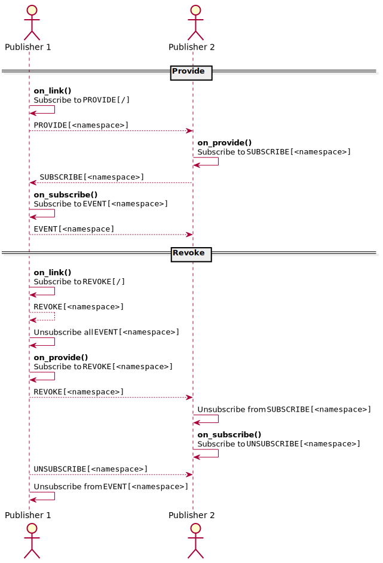

# Pub/Sub

Provides a publisher and subscriber to handle message routing.

## Publisher Linking

When a new client joins the server, its publisher goes through a linking process with
other publishers, so that they can exchange messages. This is bootstrapped with the
`Publisher::link` method.

### Workflow

